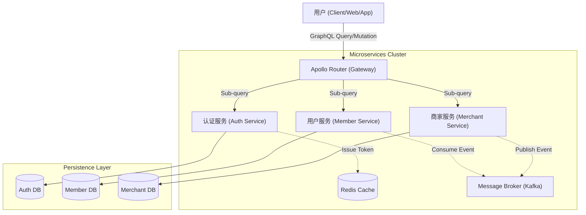
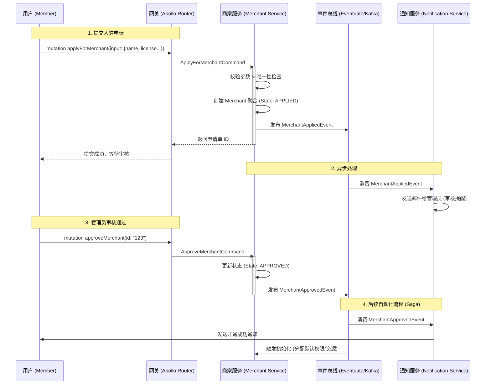

+++
date = '2026-03-13T13:43:17+08:00'
draft = true
title = 'Architecture'
+++
# 平台微服务架构设计与商家入驻流程技术方案

本文档阐述基于 **Spring Boot + Spring for GraphQL Federation + Event Driven** 的云原生友好微服务架构设计，重点涵盖 **用户认证** 与 **商家入驻** 流程。系统采用 **六边形架构（Hexagonal Architecture）** 模式，确保业务的高内聚与低耦合。

## 1. 总体架构设计 (System Architecture)

本系统采用 **微服务（Microservices）** 架构，通过 **GraphQL Federation** 构建统一的 GraphQL 数据图（Supergraph）。各服务独立部署、独立存储，通过事件驱动（Event-Driven）机制进行协作。

### 1.1 核心技术栈与优势
*   **接入层 (Gateway)**: **Spring Gateway** 和 **Apollo Router**
    *   **优势**:
    *   **作为统一流量入口，负责请求路由、鉴权、聚合子图（Subgraphs）结果。相比传统 REST API 网关，它能按需查询，减少网络开销（Over-fetching/Under-fetching）。**
    *   **前端对接友好，只需`1`种请求方式`POST`请求同一端点如`/graphql`，发送内容结构一致无需传统 REST API花样百出，后端可通过每个请求具体的字段名进行精细的宽展权限控制**
*   **接口层 (API)**: **Spring Boot + Spring for GraphQL**
    *   **优势**:
        *   **基于官方标准，与 Spring 生态（Security, GraphQL）无缝集成；支持传统编程模型，开发体验流畅。**
        *   **通过GraphQL DateRevolver BatchLoader解决 N+1 问题，确保查询高效**
*   **业务模型层 (Domain)**: **业务内聚**
    *   **优势**:
        *   **极简建模体验**: 由于使用了 GraphQL 特性，**每个模块的模型设计保持极致简单**。服务间仅需引用关联对象的 **ID**（如商家服务仅存 `ownerId`），无需在代码或数据库层面处理复杂的跨服务关联。数据的聚合与拼装完全由 GraphQL 层自动处理，显著降低了开发心智负担与维护成本。
        *   **聚合根（Aggregate Root）** 保证业务操作的原子性。
        *   **业务事件（Domain Events）** 实现微服务间的解耦与最终一致性（如：商家服务 -> 通知服务）。
        *   **Saga 模式**: 处理跨服务的长事务（如：商家入驻涉及账号创建、权限分配、支付签约）。
*   **基础设施层 (Infrastructure)**: **JPA (Hibernate) + Redis**
    *   **优势**: 通过 `Repository` 接口倒置依赖，业务逻辑不依赖具体数据库实现。

### 1.2 系统架构图 (System Context)

---

## 2. 业务流程与技术实现

### 2.1 用户体系设计 (User/Member)

**Member** 服务作为核心用户中心，管理平台所有用户（包含 C 端用户和 B 端商家员工）。

#### 2.1.1 核心模型
*   **Member**: 聚合根，包含基础信息（Email, Phone, Password）。
*   **Identity Provider**: 支持本地密码验证及 OAuth2（微信/其他第三方）绑定。

#### 2.1.2 登录认证流程 (Authentication Flow)
采用 **JWT + Cookie** 模式，结合 Spring Security 实现无状态认证。

1.  **登录请求**: 用户提交凭证（账号密码/验证码）。
2.  **校验**: `Authentication Service` 校验凭证，通过 `RateLimiter` 防止暴力破解。
3.  **颁发令牌**: 生成 JWT (`AccessToken`) 和 `RefreshToken`。
    *   *技术细节*: `AccessToken` 短效，用于 API 调用；`RefreshToken` 长效，存储在 `HttpOnly Cookie` 中，防止 XSS 攻击。
4.  **上下文传递**: 请求经过 Apollo Router 时，Token 被解析并透传给后端子服务，通过 `SecurityContext` 恢复用户身份。

**优势**:
*   **安全性**: `HttpOnly Cookie` 避免了 Token 被前端脚本窃取。
*   **性能**: JWT 自包含用户信息，网关无需频繁查库校验。

---

### 2.2 商家入驻流程设计 (Merchant Onboarding)

**Merchant** 服务独立管理商家（Tenant）生命周期。

#### 2.2.1 商家入驻状态机
入驻是一个长流程，需设计状态机管理：
`APPLIED` (已申请) -> `UNDER_REVIEW` (审核中) -> `APPROVED` (已通过) -> `ACTIVE` (已激活/已缴费)

#### 2.2.2 入驻时序图 (Onboarding Sequence)

#### 2.2.3 关键技术点
1.  **CQRS (命令查询职责分离)**:
    *   **写操作 (Command)**: 如 `applyForMerchant`，只负责校验和状态变更，不返回复杂视图数据，保证高性能。
    *   **读操作 (Query)**: 如查询商家列表，利用 `BatchLoadingOptimizer` 解决 N+1 问题，确保列表查询高效。
2.  **事件驱动 (Event-Driven)**:
    *   **解耦**: 商家服务不需要知道“审核通过后要发邮件”、“要初始化存储空间”。它只负责发布 `MerchantApprovedEvent`。
    *   **扩展性**: 未来如果新增“审核通过后赠送优惠券”功能，只需新增一个监听器，无需修改核心代码。
3.  **六边形架构**:
    *   核心业务逻辑（`Merchant` 实体）不依赖 Spring 或数据库注解，纯净且易于单元测试。
    *   所有外部依赖（数据库、第三方 API）通过接口适配器（Infrastructure）注入。

## 3. 部署与演进策略

本架构设计天然支持 **微服务部署**，同时也兼容 **模块化单体** 模式，以适应不同的基础设施环境。

*   **微服务模式 (Default)**: 各模块（Auth, Member, Merchant）打包为独立的 Docker 容器，云原生天然友好，通过 Kubernetes 进行编排。Gateway作为统一入口，动态路由至各服务实例。
*   **兼容单体模式**: 由于代码层面保持了严格的模块隔离（Module Isolation），所有模块也可以打包在一个 JAR 中运行，仅需调整 Gateway 的路由配置指向同一实例。

---

## 4. 总结
本架构设计严格遵循 **“高内聚、低耦合”** 原则。通过采用微服务架构（Microservices）与事件驱动（Event-Driven）模式，不仅能快速实现商家入驻流程，还能确保系统具备支撑未来业务指数级增长的能力。

**核心优势**:
1. **业务清晰**: `Member` (用户) 与 `Merchant` (商家) 职责分离，服务边界明确。
2. **技术先进**: GraphQL Federation + Event Sourcing，保证了灵活性与性能。
3. **可维护性**: 严格的六边形架构，让代码易于测试和维护。
4. **无技术债务**: 基于优秀且全球性庞大基数的顶级完全免费开源框架及中间件，没有技术黑盒内幕供应商锁定等问题，后续版本升级迭代无后顾之忧。
5. **无数据库供应商锁死**: 项目无手动编写的原生SQL，由ORM生成数据库操作SQL的同时保持模型单方面自我简洁性(通常无需考虑1对多多对多复杂关系)，无感切换数据库
6. **开发流程**: 理解需求 -> 设计关联GraphQL Schema -> 业务模型 -> ORM数据库映射： 自动生成常规CRUD操作接口，AI辅助编码或手动实现定制业务逻辑

---

## 5. 技术选型决策与对比 (Technical Decision & Trade-offs)

现本项目处于0-1阶段，对市面主流的 Java 快速开发平台（如 **芋道源码 (Yudao)**、**若依 (RuoYi)**）进行了深入的架构评审与代码审计。基于长期维护成本、技术债务风险及工程规范性考虑，最终决定**放弃**采用此类“开箱即用”但臃肿的框架，转而采用当前的高内聚微服务架构。

以下是本次技术选型的详细对比记录与决策依据：

| 评估维度 | 本架构方案 (Selected Architecture) | 传统脚手架 (Yudao / RuoYi) |
| :--- | :--- | :--- |
| **依赖风险与合规性** | **完全自主可控** 基于官方标准 Spring 生态构建，无第三方黑盒依赖，无隐形付费墙，文档与代码完全透明。 | **高风险 / 过度营销** 核心文档常需付费或关注公众号解锁（“知识星球”门槛）；项目热度（Star）虽高但存在过度营销嫌疑，实际代码质量与热度不符，存在收割新手开发者（“韭菜”）的倾向。 |
| **代码质量与规范** | **六边形架构 + 面向业务架构** 业务逻辑纯净，严格遵守 SOLID 原则。代码可读性高，易于测试与维护，符合长期工程演进需求。 | **CRUD 堆砌 / 违背设计原则** 简单的 CRUD 功能与臃肿的组件功能无序堆叠，缺乏设计模式支撑。代码耦合度极高，难以进行有效的单元测试。 |
| **技术前瞻性** | **云原生 + GraphQL Federation** 技术选型前瞻，拥抱国际标准。模块间解耦彻底，支持独立演进与扩展。 | **技术陈旧 / 缺乏特色** 技术栈缺乏亮点，仅是常规组件的拼凑。扩展性差，二次开发极易演变为“屎山”代码（Spaghetti Code），长期维护成本极高。 |
| **功能实用性** | **按需构建 / 极简主义** 仅包含核心基础能力，业务功能按需实现，无冗余代码，轻量级启动。 | **功能臃肿 / 强行捆绑** 内置大量对常规项目无用的功能，剔除困难（需手动大量删改）。技术债务严重，初始包袱极重。 |
| **版本维护与升级** | **依赖透明 / 升级平滑** 基于 Spring 生态标准，依赖清晰，升级路径顺畅，紧跟社区安全补丁。 | **版本锁死 / 升级困难** 核心库往往经过魔改或版本老旧，向上升级被开源方“吊胃口”式锁死，导致项目长期滞后于主流技术栈，安全性与稳定性堪忧。 |
| **数据持久层** | **JPA/Hibernate (ORM)** 无手写 SQL，自动生成高效查询，模型简洁，无感切换数据库，无供应商锁定。 | **MyBatis / 手写 SQL** 充斥大量复杂的手写 SQL，与特定数据库深度绑定（Vendor Lock-in），迁移与维护成本极高。 |

### 选型结论
经过综合评估，认为芋道/若依等框架虽然上手快，但其 **“过度封装”** 与 **“商业化导向”**（如文档收费、社群割韭菜）在长期项目中会转化为巨大的**技术债务**与**维护风险**。因此，本项目坚持采用符合软件工程标准的自研架构，以确保系统的**可维护性、可扩展性**与**技术自主权**。

### 5.1 深度解析：为何拒绝“快餐式”框架 (Why We Reject "Fast-Food" Frameworks)

基于深入代码审计，总结了此类“快餐式”框架普遍存在的**三大架构反模式**，这些问题在项目后期往往是致命的：

#### 1. "Wrapper Hell" (过度封装陷阱)
此类框架倾向于对 Spring Boot/MyBatis 等标准库进行**非必要的二次封装**。
*   **后果**: 开发者无法直接查阅 Spring 官方文档解决问题，必须依赖框架作者提供的（往往不完整或付费的）文档。
*   **案例**: 自定义的 `@Log`、`@Auth` 注解往往掩盖了底层实现，一旦出现 Bug，调试难度呈指数级上升。

#### 2. "Bloatware" (功能臃肿与巨石噩梦)
为了吸引更多 Star，此类框架往往将商城、ERP、CRM、BPM 工作流等所有功能塞入一个仓库。
*   **后果**: 即使只需要一个简单的后台管理，也必须引入数吨重的依赖。
*   **痛点**: 想要剔除“商城”模块，往往发现它与“用户模块”在数据库层面有几百个外键关联，根本拆不掉。

#### 3. "Anemic Domain Model" (贫血模型与 CRUD 堆砌)
代码中充斥着大量的 `Service` 层逻辑与复杂的 SQL 拼接，实体类（Entity）仅仅是数据库表的映射（Getter/Setter）。
*   **后果**: 业务逻辑分散在 Service 和 SQL 中，复用性极差。一旦业务规则变更（如：修改订单状态流转），需要同时修改十几处代码。

#### 4. "AI-Hostile Environment" (AI 协作障碍)
在 LLM (大语言模型) 辅助编程日益普及的今天，此类框架的**非标准化特性**成为了巨大的阻碍。
*   **Token 浪费**: 由于大量的自定义封装（BaseController, BaseService, Wrapper）和冗余代码，AI 在理解上下文时需要消耗极大的 Token 数量，导致真正有价值的业务逻辑被“挤出”上下文窗口。
*   **幻觉风险**: AI 模型主要基于标准的开源框架（如 Spring Boot 官方文档）进行训练。面对这些魔改的“方言”代码，AI 往往无法准确推断其行为，导致生成的代码出现幻觉或无法运行。
*   **理解断层**: 无论是新入职的开发者还是 AI Copilot，都需要花费大量时间去“反向工程”框架作者的个人习惯，而非直接专注于业务逻辑。
## 6. 本架构的工程宣言 (Our Architectural Manifesto)

相信，优秀的软件不仅仅是功能的堆砌，更是**工程美学**的体现。本架构遵循以下核心原则：

### 6.1 长期主义 (Long-termism)
*   **拒绝“黑盒”**: 只使用全球公认的标准技术栈（Spring, GraphQL, JPA）。任何开发者阅读官方文档即可上手，无需学习私有“方言”。
*   **资产而非负债**: 代码是负债，功能才是资产。致力于通过**精简的设计**减少代码行数，而非通过生成器生成大量垃圾代码。

### 6.2 认知负荷优化 (Cognitive Load Optimization)
*   **六边形架构**: 将业务逻辑与技术实现（HTTP, Database）物理隔离。开发者在编写业务时，无需关心是存入 MySQL 还是 Redis。
*   **显式优于隐式**: 拒绝过多的“魔法”注解。关键流程（如鉴权、状态变更）应清晰可见，易于调试。

### 6.3 业务为王 (Domain Driven)
*   **充血模型**: 业务行为（如 `user.changePassword()`）应封装在业务对象内部，而不是散落在 Service 层。
*   **语言通用性**: 建模反映的是**业务语言**，而非数据库表结构。这使得代码能直接与产品经理的文档对应。否则说白了就是在做“漂亮的数据库编辑器/另一个Excel。”

> **"Any fool can write code that a computer can understand. Good programmers write code that humans can understand."** — Martin Fowler
