+++
title = '天平系统领域模块化落地说明 - 高级版本差异'
date = '2026-05-13T00:00:00+08:00'
+++

# 天平系统领域模块化落地说明 - 高级版本差异

## 1. 文档口径

这份文档只描述高级版本相对[基线版本](/xshopee/original/)的差异。

没有在本文件重新展开的模块，均参阅基线版本定义：

- 身份与 Shopee 授权模块参阅基线版本定义。
- 订单同步模块参阅基线版本定义。
- 托管锁款账户模块参阅基线版本定义。高级版本只新增责任片段占用明细。
- 账户流水模块参阅基线版本定义。高级版本只要求运营回款流水带责任片段。
- 货币与汇率模块参阅基线版本定义。
- 提现、保证金、通知任务、排行榜参阅基线版本定义。

高级版本只改变一个核心边界：

**基线版本一个店铺同一时刻只有一个运营；高级版本一个店铺可以按经营品类、商品或人工规则分配给多个运营。**

## 2. 基线版本和高级版本的差异

| 范围        | 基线版本                    | 高级版本                      |
|-----------|-------------------------|---------------------------|
| 店主身份      | 一个邮箱用户可绑定多个 Shopee 店铺   | 不变，参阅基线版本定义               |
| Shopee 授权 | 按 `shop_id` 授权和刷新 token | 不变，参阅基线版本定义               |
| 店铺合作      | 一个店铺同一时刻一个运营            | 一个店铺可启用多个运营合作范围           |
| 店铺商品      | 基线版本不依赖商品责任配置           | 高级版本必须同步店铺商品和 SKU，供责任规则选择 |
| 合约        | 一份店铺合作合约绑定一个运营          | 合约还要表达运营可负责的经营品类、商品或店铺范围  |
| 订单责任      | 整单归属店铺当前运营              | 按订单行切成多个责任片段              |
| Shopee 拆单 | 只作为履约展示能力               | 在 Shopee 支持时按责任片段拆给不同运营履约 |
| 发货任务      | 一个订单一个运营任务              | 一个订单可生成多个运营发货任务           |
| 托管锁款账户    | 按订单锁款                   | 仍按订单锁款，同时记录责任片段占用明细       |
| 结算        | 一个订单一个运营回款              | Shopee 仍订单级结算，天平内部按责任片段清分 |
| 售后回冲      | 按订单原运营回冲                | 按原订单责任片段回冲对应运营            |

容易混淆的地方：

- 基线版本和高级版本都不改变 Shopee 外部订单事实。
- 高级版本的“责任片段”是天平内部责任，不是 Shopee 官方订单归属。
- 高级版本的“按片段清分”是天平内部清分，不是 Shopee 给多个运营分别结算。

## 3. 高级版本新增领域地图

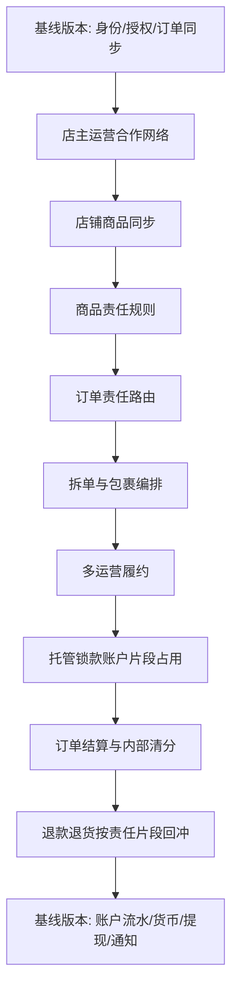

## 4. 模块一：店主运营合作网络

### 4.1 模块使用者与系统行为

这个模块管理店主、运营、店铺之间的合作网络。它回答一个问题：这个店主允许哪些运营参与哪些店铺的经营。

使用者：

- `Shopkeeper`：店主。邀请运营，选择运营可参与的店铺范围，停用合作。
- `Operator`：运营。接受或拒绝合作邀请。
- `Management`：管理员。处理异常合作、停用合作、处理争议。

系统行为清单：

- 店主邀请一个或多个运营合作。
- 店主选择运营可参与的店铺范围。
- 运营接受或拒绝合作邀请。
- 合作接受后等待合约签署版本。
- 签署版本完成后启用店铺运营范围。
- 店主或管理员停用整个合作关系。
- 店主或管理员移除某个店铺运营范围。
- 店铺启用多个运营后，必须继续配置经营品类、商品或店铺默认责任规则。

### 4.2 核心模型

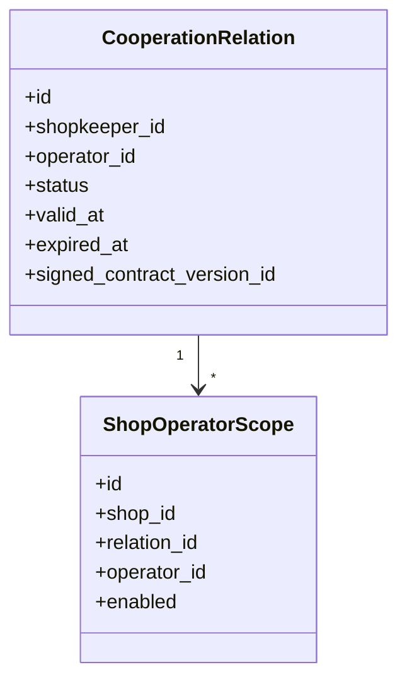

### 4.3 店主邀请运营流程

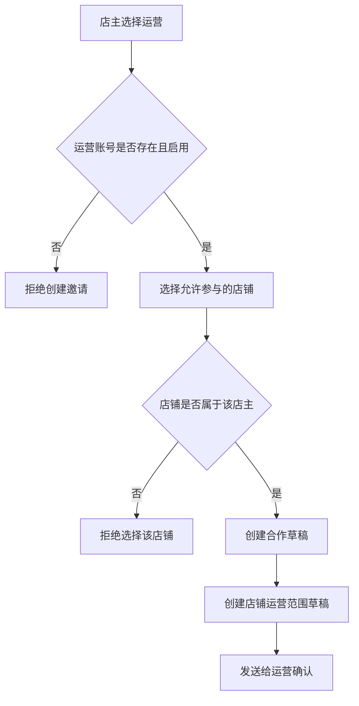

### 4.4 启用店铺运营范围流程

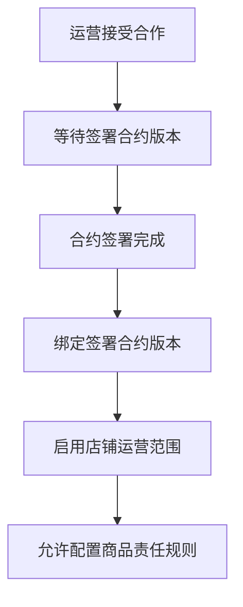

### 4.5 流程补充

- 合作网络只说明“谁可以合作”，不说明“哪个商品归谁”。
- 店铺启用多个运营时，如果没有责任规则，订单不能进入履约。
- 合作关系停用后，旧订单仍按创建时的合作快照追溯。

## 5. 模块二：合约与签署版本差异

### 5.1 模块使用者与系统行为

合约基础流程参阅基线版本定义。高级版本新增的是：合约必须表达运营可负责的店铺、经营品类、商品或默认范围。

使用者：

- `Management`：管理员。维护多运营合作模板，核对责任范围和敏感数字。
- `Shopkeeper`：店主。确认哪些经营品类或商品由哪个运营负责。
- `Operator`：运营。确认自己接受的经营品类或商品责任范围。

系统行为清单：

- 管理员选择多运营合作模板。
- 系统录入店主、运营、店铺范围、经营品类或商品范围。
- 系统录入分账比例、保证金、运费责任、有效期。
- 大模型辅助审阅范围冲突、比例异常、敏感数字异常。
- 管理员核对后保存待签署版本。
- 店主和运营签署后生成不可变签署版本。
- 商品责任规则只能引用已签署且有效的合约版本。

### 5.2 合约生成与签署流程

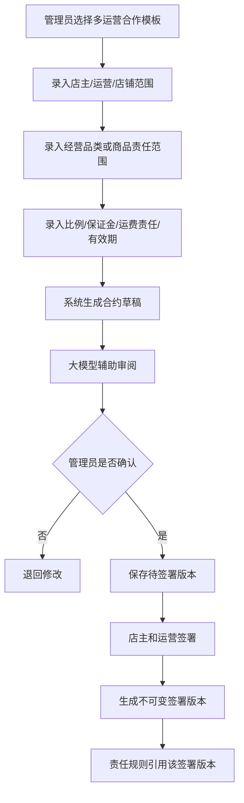

### 5.3 流程补充

- 基线版本合约主要服务“店铺 + 唯一运营”。
- 高级版本合约还要服务“店铺 + 多个运营 + 商品责任范围”。
- 责任范围变更不能覆盖旧签署版本，只能生成新签署版本。
- 订单责任片段创建时复制签署版本快照；后续合约变更不影响历史片段。

## 6. 模块三：店铺商品同步

### 6.1 模块使用者与系统行为

高级版本要按经营品类和商品分配运营，所以必须先同步 Shopee 店铺商品、SKU/model 和类目信息。商品责任规则只能从已同步的店铺商品或类目里选择，不能让店主手工随便输入一个不存在的 SKU。

使用者：

- `Shopkeeper`：店主。查看已同步的店铺商品、SKU 和类目，并基于它们配置责任规则。
- `Management`：管理员。处理商品同步失败、商品数据异常、类目缺失等问题。
- `SystemJob`：系统任务。按店铺同步 Shopee 商品、SKU、类目和上下架状态。

系统行为清单：

- 店铺授权成功后，系统同步该店铺商品列表。
- 系统同步商品下的 SKU、model、库存、价格、类目、上下架状态等用于识别责任的字段。
- 商品或 SKU 变化后，系统更新本地商品快照。
- 已下架商品仍保留历史快照，便于历史订单和售后追溯。
- 店主配置责任规则时，优先选择经营品类或商品；SKU 只作为少数例外覆盖。
- 商品同步失败时创建任务给管理员处理。

### 6.2 核心模型

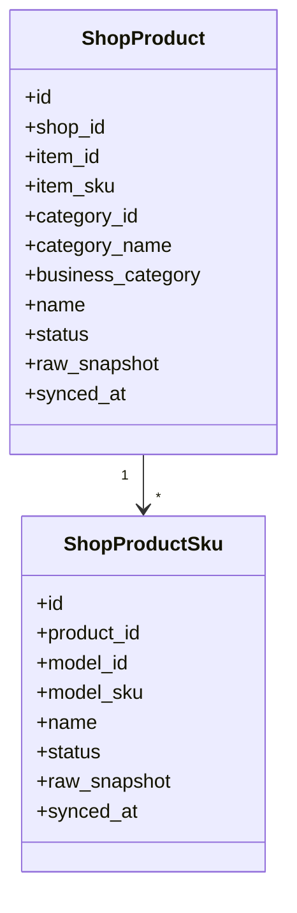

### 6.3 店铺商品同步流程

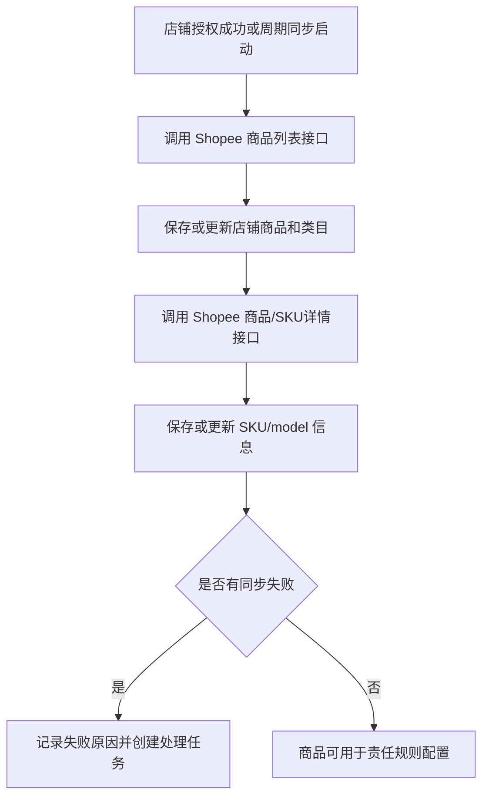

### 6.4 流程补充

- 商品同步是高级版本配置责任规则的前置条件。
- 商品和 SKU 的本地记录必须保留 Shopee 原始标识：`item_id`、`item_sku`、`model_id`、`model_sku`。
- 商品必须保存 Shopee 类目或本地经营品类，用于按产品大类配置运营责任。
- 商品下架不删除本地记录，只更新状态。
- 订单责任路由优先按经营品类和商品匹配责任规则；SKU 只作为例外覆盖。

## 7. 模块四：商品责任规则

### 7.1 模块使用者与系统行为

商品责任规则决定订单行归哪个运营。高级版本不是先看整单归谁，而是先按经营品类判断，再按商品判断；SKU 只作为少数例外覆盖。

使用者：

- `Shopkeeper`：店主。配置经营品类、商品、店铺默认或人工指定规则；SKU 仅在确有必要时配置例外规则。
- `Management`：管理员。处理规则冲突和人工分配。
- `Operator`：运营。被规则引用后承担对应商品责任。

系统行为清单：

- 店主选择可服务该店铺的运营。
- 店主从已同步的经营品类和商品中配置责任规则。
- 系统校验运营是否在启用合作范围内。
- 系统校验规则是否引用已签署且有效的合约版本。
- 系统校验同一经营品类或商品同一时间是否冲突。
- 规则生效后供订单责任路由读取。
- 规则变更只影响新订单行。
- 未命中规则的订单行进入人工分配池。

规则优先级：

1. 人工指定规则。
2. SKU 例外规则。
3. 商品规则。
4. 经营品类规则。
5. 店铺默认运营规则。
6. 人工待分配池。

### 7.2 核心模型

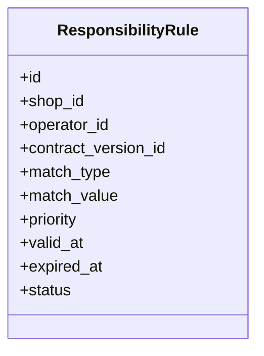

### 7.3 规则配置流程

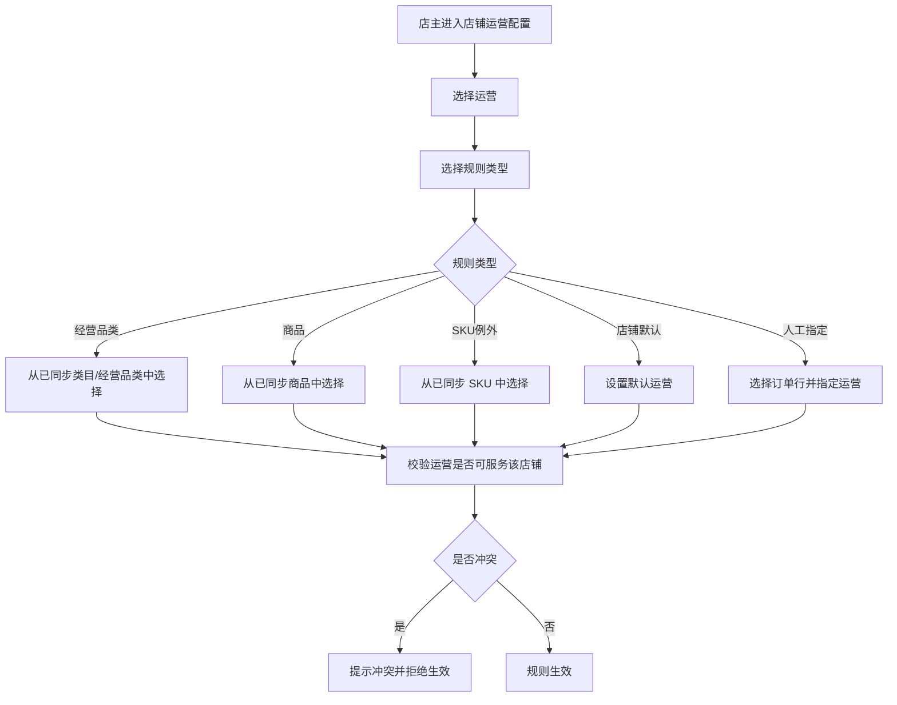

### 7.4 流程补充

- 同一店铺同一经营品类或商品同一时间只能命中一个有效运营。
- SKU 规则只用于特殊型号确实由不同供货商负责的例外场景。
- 经营品类、商品和 SKU 都必须来自店铺商品同步结果。
- 规则必须引用已签署且有效的合约版本。
- 规则变更只影响变更后的新订单行。

## 8. 模块五：订单责任路由

### 8.1 模块使用者与系统行为

订单责任路由把 Shopee 订单行切成运营责任片段。一个订单可以有多个责任片段，每个责任片段只归一个运营。

使用者：

- `SystemJob`：系统任务。订单详情同步完成后执行自动路由。
- `Management`：管理员。处理未命中规则、冲突和异常改派。
- `Shopkeeper`：店主。处理需要店主确认的人工分配。

系统行为清单：

- 接收基线版本订单同步模块产生的订单详情。
- 拆出 Shopee 订单行。
- 逐行匹配责任规则。
- 命中规则后按运营合并生成责任片段。
- 冻结规则、合作网络和合约签署版本快照。
- 未命中规则的订单行进入人工分配池。
- 全部订单行完成责任归属后进入拆单与包裹编排。

### 8.2 核心模型

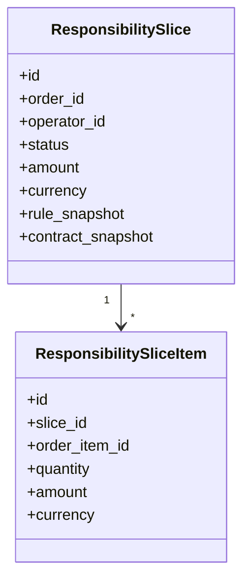

### 8.3 路由流程

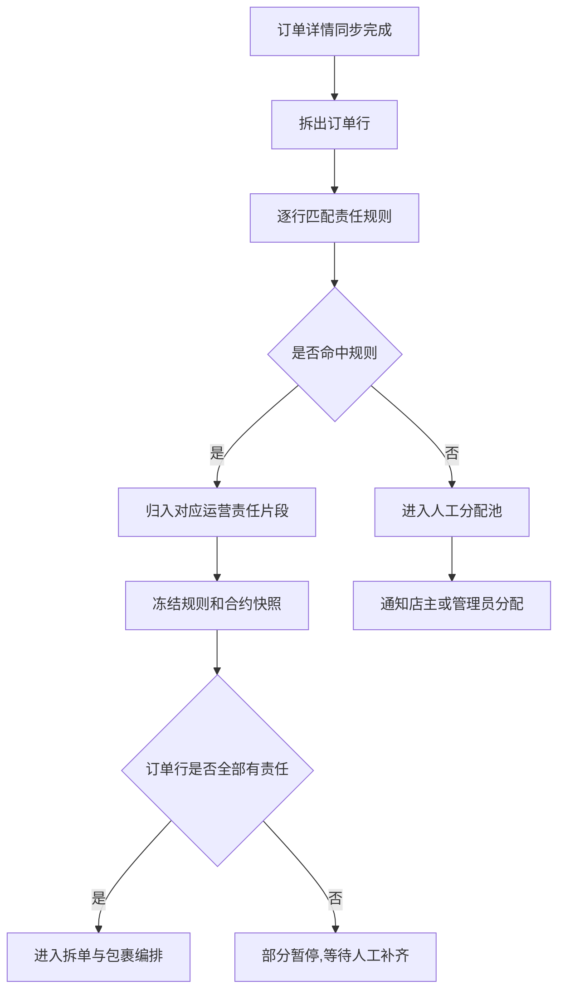

### 8.4 流程补充

- 责任片段是高级版本的核心。
- 责任片段生成后不可因规则变更自动重算。
- 人工改派只允许在未发货前发生；已发货后必须走异常处理和审计。
- 退款回冲时读取原责任片段，不读取当前最新规则。

## 9. 模块六：拆单与包裹编排

### 9.1 模块使用者与系统行为

高级版本在 Shopee 支持拆单/拆包时，尽量让包裹边界和运营责任片段一致。

使用者：

- `SystemJob`：系统任务。检查 Shopee 拆单条件、调用拆单、同步包裹详情。
- `Management`：管理员。处理不能拆单、混合包裹和主履约运营确认。
- `Shopkeeper`：店主。必要时确认混合包裹履约安排。
- `Operator`：运营。接收与自己责任片段或主履约包裹相关的任务。

系统行为清单：

- 接收责任片段完成事件。
- 判断订单是否涉及多个运营。
- 单运营订单按基线版本履约。
- 多运营订单检查 Shopee 是否允许拆单。
- 允许拆单时按责任片段调用 Shopee 拆单。
- 拆单后重新读取 package detail。
- 不允许拆单时生成混合包裹计划。
- 混合包裹要求人工指定主履约运营。

### 9.2 拆单编排流程

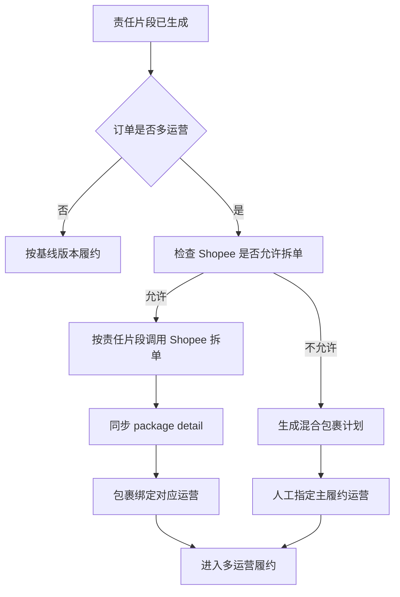

### 9.3 流程补充

- 拆单成功后必须重新读取 Shopee package detail。
- 拆单失败不能改变责任片段，只改变履约方式。
- 混合包裹必须记录主履约运营和参与责任运营。

## 10. 模块七：多运营履约

### 10.1 模块使用者与系统行为

多运营履约处理多个运营的发货任务。包裹计划完成后，系统按运营和包裹生成任务。

使用者：

- `Operator`：运营。查看自己的责任片段、包裹和发货任务。
- `SystemJob`：系统任务。同步 Shopee 包裹、物流和揽收状态。
- `Shopkeeper`：店主。查看订单多运营履约进度。

系统行为清单：

- 单运营订单参阅基线版本履约流程。
- 多运营拆单成功时，按运营和包裹生成发货任务。
- 混合包裹只给主履约运营生成物流发货任务。
- 运营按 Shopee 规则发货。
- 系统只记录 Shopee 或物流同步到的事实状态。
- 揽收失败时生成重新发货任务。
- 订单取消后关闭未完成任务。

### 10.2 履约流程

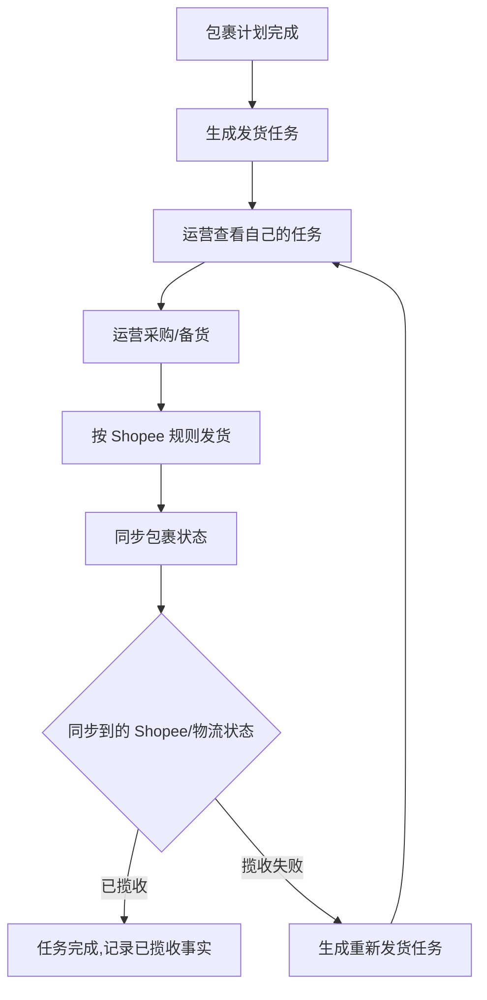

### 10.3 流程补充

- 未托管成功的责任片段不能生成可执行发货任务。
- 天平不手动制造订单状态，只记录 Shopee 或物流同步到的事实状态。
- 混合包裹由主履约运营负责物流，其他责任运营仍按责任片段参与结算和售后。

## 11. 模块八：托管锁款账户差异

### 11.1 模块使用者与系统行为

托管锁款账户基础流程参阅基线版本定义。高级版本新增责任片段占用明细。

系统行为清单：

- 仍按订单级托管锁款账户锁款。
- 锁款成功后，按责任片段记录占用明细。
- 发货任务检查责任片段是否被订单级锁款覆盖。
- 店主预付款不足时，记录托管失败并按基线版本提醒充值。

### 11.2 托管锁款账户流程

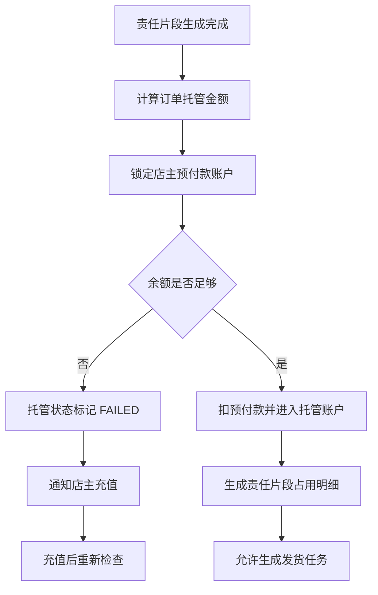

## 12. 模块九：订单结算与内部清分

### 12.1 模块使用者与系统行为

基线版本是一个订单一个运营回款。高级版本仍读取 Shopee 订单级 escrow，但在天平内部按责任片段清分到多个运营。

使用者：

- `SystemJob`：系统任务。按基线版本同步 escrow 明细。
- `Shopkeeper`：店主。查看订单结算和店主佣金。
- `Operator`：运营。查看自己责任片段的回款明细。

系统行为清单：

- 读取订单级 `get_escrow_detail`。
- 保存 escrow 原始明细。
- 读取订单责任片段、订单行金额、包裹归属和合约快照。
- 按责任片段拆分可分账金额。
- 计算店主佣金、平台佣金和多个运营回款。
- 运费按责任运营、片段比例或人工确认结果归属。
- 生成订单结算单和片段清分明细。
- 多运营回款流水必须带责任片段 ID。

### 12.2 清分流程

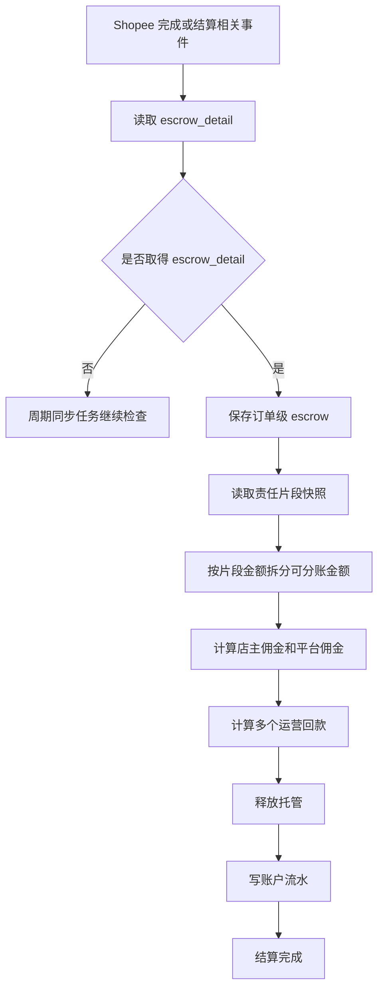

### 12.3 流程补充

- Shopee 不会直接给多个运营分别结算。
- 高级版本清分是天平内部清分。
- 订单结算完成后不能重算覆盖，只能追加调整流水。
- 责任片段清分使用订单当时的责任快照和合约快照。

## 13. 模块十：退款退货按责任片段回冲

### 13.1 模块使用者与系统行为

基线版本按订单原运营回冲。高级版本按原订单责任片段回冲。

使用者：

- `SystemJob`：系统任务。同步 Shopee 退款、退货、补贴、扣款和运费调整。
- `Management`：管理员。处理无法定位商品责任或运费归属的调整。
- `Shopkeeper`：店主。查看退款、补贴、扣罚和佣金影响。
- `Operator`：运营。查看自己责任片段的回冲、补贴和退货运费。

系统行为清单：

- 接收 Shopee 售后或账款调整事件。
- 读取售后详情或 escrow 调整明细。
- 判断订单是否已经完成内部清分。
- 结算前退款影响待清分金额。
- 结算后退款创建独立账款调整单。
- 能定位商品责任时回冲对应责任片段。
- 无法定位商品责任时按片段金额比例分摊或进入人工确认。
- 退货运费默认由责任运营承担。
- 人工确认结果必须写审计。

### 13.2 调整流程

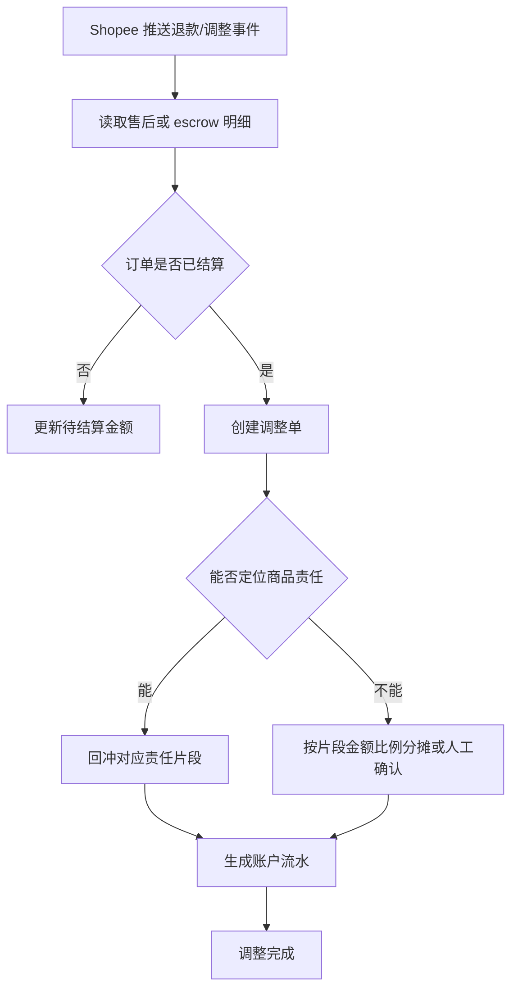

### 13.3 流程补充

- 已结算订单不修改原结算单。
- 调整必须关联责任片段；确实无法关联时进入人工确认。
- 人工确认的分摊结果必须审计，后续不能静默修改。

## 14. 端到端高级流程

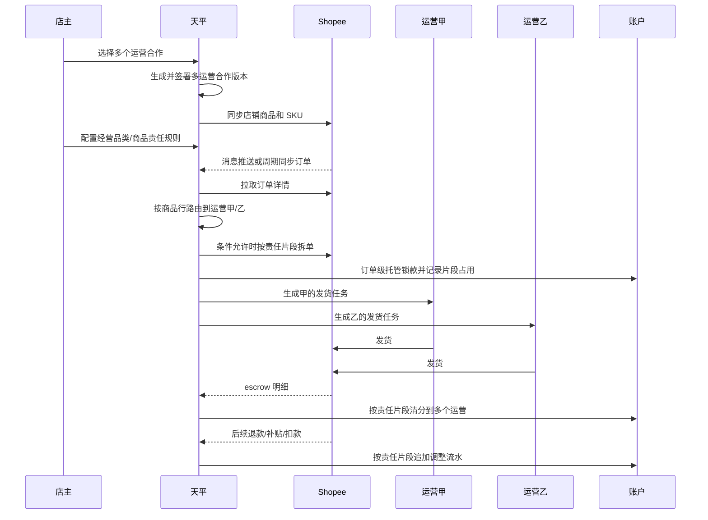

## 15. 高级版本落地顺序

高级版本必须在基线版本可运行后再落地。

1. 参阅基线版本完成身份、授权、订单同步、托管锁款账户、履约、结算、账户流水。
2. 增加店主运营合作网络。
3. 增加多运营合约责任范围。
4. 增加店铺商品和 SKU 同步。
5. 增加经营品类、商品、店铺默认责任规则；SKU 只作为例外规则。
6. 增加订单责任路由和责任片段快照。
7. 增加 Shopee 拆单校验、包裹计划、混合包裹人工任务。
8. 增加多运营发货任务。
9. 增加托管锁款账户责任片段占用明细。
10. 增加 escrow 订单级结算和片段级内部清分。
11. 增加退款退货按责任片段回冲。

## 继续查看

- [基线版本](/xshopee/original/)
- [技术架构](/xshopee/architecture/)
