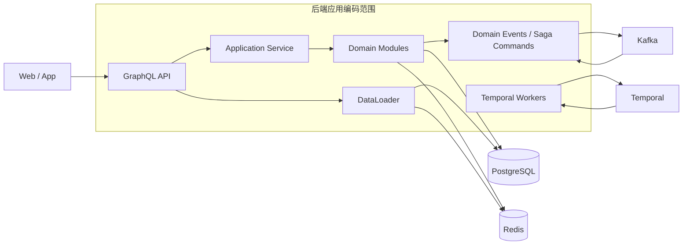
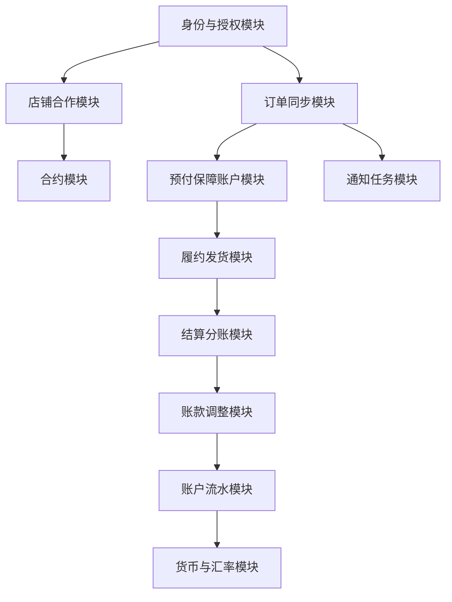
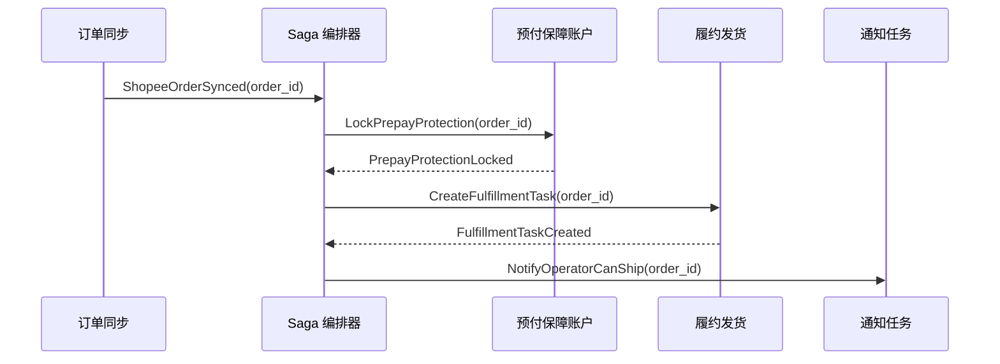
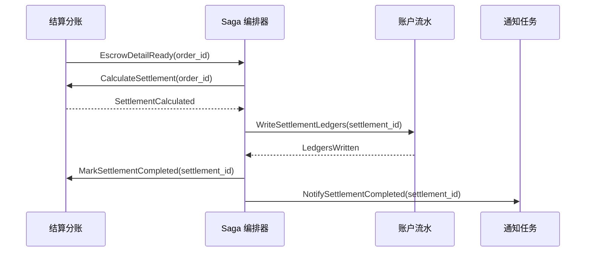
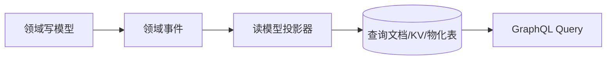

+++
title = '天平系统技术架构说明'
date = '2026-05-13T00:00:00+08:00'
+++

# 天平系统技术架构说明

## 1. 文档口径

这份文档描述天平系统的技术架构。业务边界参阅：

- [基线版本业务定义](/xshopee/original/)。
- [高级版本差异定义](/xshopee/advanced/)。

技术架构目标：

- 模块间日常交互使用事件驱动架构。
- 涉及多模块同时变更的流程使用 Saga 编排。
- 外部接口和前端数据获取使用 GraphQL 简化聚合读取。
- 领域模型落库保持简单 ID 引用，不做多表深层对象嵌套。
- GraphQL DataLoader 层负责批量加载关联数据，避免 N+1 和多表嵌套查询。
- 高吞吐读场景必要时引入 CQRS，使用查询文档或 KV 存储承载读模型。
- 订单同步、周期任务、补偿任务可引入 Temporal，保证任务可恢复、可重试、可观测。

## 2. 总体架构



部署起步方式：

- 初期使用一个后端应用容器打包部署多个业务模块。或独立部署订单同步模块
- 模块内部使用清晰包边界和应用服务边界。
- 模块之间避免直接跨模块改表，优先通过命令、领域事件、查询接口交互。
- 订单同步模块可优先独立拆分部署，因为它与 Shopee 接口、周期任务、重试、限流关系更强。
- 后期可以按模块拆成微服务，并迁移到 Kubernetes 云原生部署。

## 3. 推荐技术栈

| 层次         | 技术                      |
|------------|-------------------------|
| 后端语言       | Java 25                 |
| 应用框架       | Spring Boot             |
| API        | GraphQL                 |
| 安全         | Spring Security + JWT   |
| Web 登录态    | JWT Cookie              |
| 原生 App 登录态 | Bearer Token            |
| AI 能力      | Spring AI               |
| 缓存         | Redis                   |
| 消息         | Kafka                   |
| ORM        | JPA                     |
| 主数据库       | PostgreSQL              |
| 工作流任务      | Temporal                |
| 高吞吐读模型     | CQRS + 文档数据库或 KV 数据库    |
| 部署         | Docker 容器，后期 Kubernetes |

PostgreSQL 作为主库的原因：

- 单库能力强，适合复杂业务事务和账务一致性。
- 支持 JSON、索引、分区、物化视图等能力。
- 支持向量扩展，未来可以承载 AI 审阅、合同风险、商品匹配等向量检索场景。
- 相比把核心账务拆散到多个存储，PostgreSQL 更利于保证账务和审计的一致性。

## 4. 模块边界



高级版本新增模块参阅 [高级版本差异定义](/xshopee/advanced/)：

- 店主运营合作网络。
- 店铺商品同步。
- 商品责任规则。
- 订单责任路由。
- 拆单与包裹编排。
- 多运营履约。
- 片段级内部清分。
- 责任片段售后回冲。

模块设计原则：

- 每个模块拥有自己的聚合和表。
- 聚合之间落库只保存 ID，不保存对方对象快照，除非是业务审计快照。
- 跨模块读取通过应用查询服务、GraphQL DataLoader 或读模型完成。
- 跨模块写入通过命令、事件或 Saga 完成。
- 账户流水、订单历史、合约签署版本属于审计事实，不能静默覆盖。

## 5. 事件驱动

日常模块交互使用事件驱动。事件用于“通知事实已经发生”，不是远程函数调用。

典型事件：

| 事件                       | 产生模块   | 消费模块            |
|--------------------------|--------|-----------------|
| `ShopAuthorized`         | 身份与授权  | 店铺合作、商品同步、订单同步  |
| `ContractSigned`         | 合约     | 店铺合作、商品责任规则     |
| `ShopeeOrderSynced`      | 订单同步   | 预付保障账户、高级版本责任路由 |
| `PrepayProtectionLocked` | 预付保障账户 | 履约发货            |
| `FulfillmentCompleted`   | 履约发货   | 结算分账            |
| `EscrowDetailSynced`     | 结算同步   | 结算分账            |
| `SettlementCompleted`    | 结算分账   | 账户流水、排行榜读模型     |
| `ShopeeAdjustmentSynced` | 账款调整   | 账户流水、通知任务       |
| `AccountLedgerWritten`   | 账户流水   | 对账、排行、经营看板      |

事件处理规则：

- 事件必须有全局唯一 `event_id`。
- 消费端按 `event_id` 或业务幂等键去重。
- 事件负载只放必要字段和业务 ID，不传完整聚合对象。
- 消费失败进入重试队列，超过阈值进入人工任务。
- 事件只代表事实，不直接承诺下游一定成功。

## 6. Saga 和命令消息

涉及多个模块同时变更的流程不能用单个数据库事务硬包所有模块，应使用 Saga。

典型 Saga：

### 6.1 订单可发货 Saga



失败补偿：

- 预付保障失败：记录失败状态，通知店主充值，不创建发货任务。
- 发货任务创建失败：保留保障锁定，创建补偿任务重试。
- 通知失败：不回滚业务，只重试通知。

### 6.2 结算分账 Saga



失败补偿：

- 账户流水写入失败：结算单保持 `PENDING_LEDGER`，重试写账。
- 通知失败：不影响结算完成。
- 已写流水不能删除，只能通过调整流水补正。

命令消息规则：

- 命令表达“要求某模块做一件事”，例如 `LockPrepayProtection`。
- 事件表达“某件事已经发生”，例如 `PrepayProtectionLocked`。
- 命令必须有业务幂等键。
- 命令处理结果必须明确成功、失败、可重试、需人工。

## 7. GraphQL 查询架构

GraphQL 用于简化前端和 App 的数据获取，不用于突破领域边界。

使用方式：

- 前端按页面需要声明字段。
- GraphQL Resolver 调用应用查询服务。
- Resolver 不直接拼复杂跨模块 SQL。
- DataLoader 按 ID 批量加载关联对象。
- 聚合落库保持简单 ID 引用。

示例：

```graphql
# noinspection GraphQLUnresolvedReference
query OrderDetail($orderId: ID!) {
    order(id: $orderId) {
        id
        orderSn
        status
        shop {
            id
            name
        }
        fulfillmentTask {
            id
            status
        }
        settlement {
            id
            status
            escrowAmount
        }
    }
}
```

后端处理方式：

```text
OrderResolver 读取 Order
ShopDataLoader 批量按 shop_id 读取 Shop
FulfillmentTaskDataLoader 批量按 order_id 读取任务
SettlementDataLoader 批量按 order_id 读取结算
```

这样避免：

- JPA 多层 eager loading。
- 多表深层 join。
- GraphQL N+1 查询。
- 聚合之间互相持有复杂对象。

## 8. 聚合落库方式

聚合表只保存自己的状态和外部聚合 ID。

示例：

```text
orders
- id
- shop_id
- shopkeeper_id
- operator_id
- status
- contract_snapshot_id

fulfillment_tasks
- id
- order_id
- operator_id
- package_number
- status

settlements
- id
- order_id
- escrow_amount
- status

account_ledgers
- id
- account_id
- order_id
- business_no
- amount
```

不建议：

- 在订单表里嵌入店铺完整对象。
- 在结算表里嵌入账户完整对象。
- 用 ORM 级联保存多个业务聚合。
- 为了页面展示做复杂实体图加载。

建议：

- 写入路径保持聚合简单。
- 查询路径用 GraphQL + DataLoader + 查询服务组装。
- 高吞吐页面用 CQRS 读模型。

## 9. CQRS 读模型

以下场景可以引入 CQRS：

- 店主首页经营看板。
- 运营待办任务列表。
- 订单搜索和筛选。
- 结算对账列表。
- 排行榜。
- 多运营高级版本的责任片段视图。

实现方式：

- 写模型仍在 PostgreSQL。
- 领域事件写出后，异步更新读模型。
- 读模型可以放 PostgreSQL 物化表、Redis、文档数据库或 KV 数据库。
- 读模型允许最终一致。
- 账务事实仍以账户流水和结算主表为准。



## 10. Temporal 任务编排

订单同步、周期任务和补偿任务可以引入 Temporal。

适合 Temporal 的场景：

- Shopee 订单周期同步。
- Shopee 商品同步。
- token 刷新和重新授权提醒。
- 已完成未结算订单轮询 escrow。
- 失败事件重试。
- 长时间售后状态跟踪。
- 结算分账 Saga。
- 预付款不足后的周期提醒。

Temporal 使用原则：

- 工作流保存长时间任务状态。
- Activity 调用 Shopee、数据库、Kafka 等外部系统。
- Activity 必须幂等。
- 工作流失败后可恢复，不依赖单机内存。
- 重要任务要有可观测状态和人工介入入口。

订单同步可以优先拆为独立部署单元：

```text
order-sync-service
- Shopee 推送接收
- Shopee 周期同步
- 商品同步
- escrow 轮询
- Temporal workers
- Kafka producers
```

## 11. Redis 使用

Redis 用于性能和短期状态，不作为账务真相。

适合放 Redis：

- 登录会话黑名单或 token 版本号。
- 验证码。
- Shopee API 限流计数。
- 热点字典和配置缓存。
- GraphQL DataLoader 请求级缓存。
- 短期任务去重标记。

不适合只放 Redis：

- 账户余额真相。
- 账户流水。
- 结算单。
- 合约签署版本。
- 订单历史。

## 12. 安全架构

认证：

- Web 使用 JWT Cookie。
- 原生 App 使用 Bearer Token。
- 管理端、店主端、运营端统一用户体系。

授权：

- 使用 Spring Security 做认证和接口权限。
- 业务权限仍由领域服务判断，例如店主只能看自己的店铺，运营只能看自己的任务或责任片段。
- Shopee token 只允许服务端授权适配层读取。
- 日志、审计、异常堆栈、消息 payload 禁止输出 Shopee token 原文。

## 13. 弹性和高性能

弹性策略：

- Shopee API 调用加超时、重试、限流和熔断。
- Kafka 消费端幂等处理。
- Temporal 任务可恢复。
- 失败事件进入人工任务。
- 账户写入使用行级锁和幂等键。

高性能策略：

- 写路径按聚合单表写入，避免大事务跨模块。
- 读路径用 GraphQL DataLoader 批量加载。
- 热点查询使用 CQRS 读模型。
- 大表如账户流水、订单历史按时间或店铺分区。
- Kafka 削峰，异步处理非阻塞任务。
- PostgreSQL 对关键字段建索引：`shop_id`、`order_sn`、`business_no`、`account_id`、`created_at`、`idempotency_key`。

## 14. 部署演进

第一阶段：模块化单体

- 一个 Spring Boot 应用。
- 一个 PostgreSQL 主库。
- Redis + Kafka。
- Temporal 可按订单任务复杂度选择引入。
- Docker 容器化部署。

第二阶段：重点模块拆分

- 订单同步模块单独部署。
- Temporal Worker 单独部署。
- GraphQL API 保持统一入口。
- Kafka 连接各模块。

第三阶段：云原生微服务

- 按模块拆服务。
- Kubernetes 部署。
- 每个服务独立扩缩容。
- 保持事件契约和 GraphQL 查询聚合能力。

## 15. 落地优先级

1. 建立模块化单体包结构和统一账户流水模型。
2. 建立 PostgreSQL 表结构、幂等键、审计字段。
3. 建立 GraphQL API 和 DataLoader 规范。
4. 建立 Kafka 事件规范。
5. 建立订单同步和 Shopee 推送处理。
6. 建立预付保障账户或当前命名下的资金保障流程。
7. 建立结算分账 Saga。
8. 引入 Temporal 处理订单同步、escrow 轮询、补偿任务。
9. 对首页、订单列表、排行榜引入 CQRS 读模型。

## 继续查看

- [基线版本](/xshopee/original/)
- [高级版本差异](/xshopee/advanced/)
